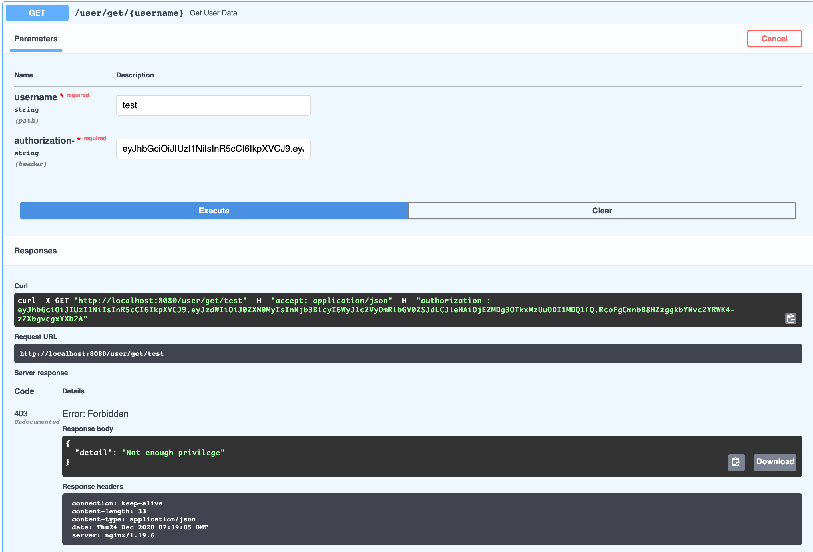

# 目的
使用Fastapi實現OAuth2.0，滿足給予帳號不同角色權限

## 使用說明
 - 確保安裝docker
 - 執行 `docker-compose up -d`
 - 進入網址 http://localhost:8080/docs
 - 使用 `openssl rand -hex 32`產生密鑰，在settings覆蓋

## 檔案結構
```text
.
├── data                        # mongodb volumes
├── restfulapi
│   ├── app
│       ├── server
│           ├── helper       
│               └── response.py # 定義回傳模型
│           ├── models       
│               └── user.py     # user model
│           ├── routes
│               └── user.py     # user route
│           ├── utils
│               ├── jwt.py      # jwt加密/解密
│               └── pwd.py      # 密碼加密驗證
│           └── database.py
│       ├── main.py             # 主要程式，啟動app
│       └── settings.py         # 設定選項
│   ├── Dockerfile
│   └── requirements.txt
├── docker-compose.yaml
├── nginx_config.conf
└── README.md               
```

## API使用說明
新增使用者在scopes給予權限，login登入後獲取token可以進行read/update/delete操作
若無權限將會出現以下錯誤



